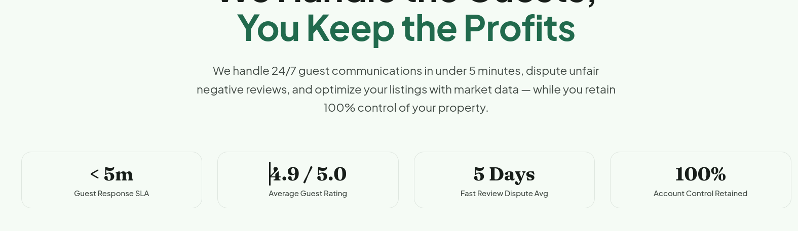
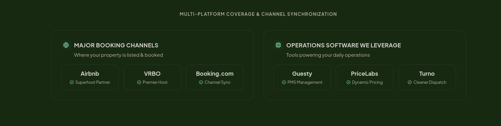
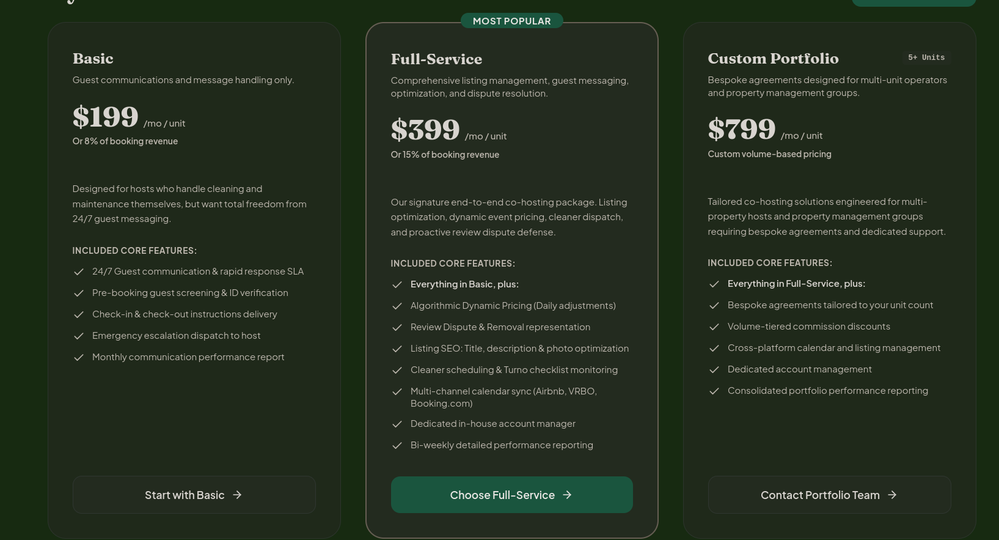
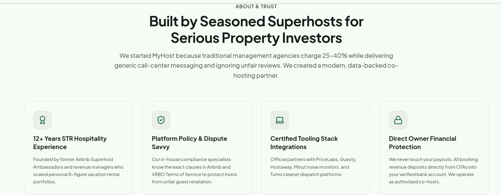
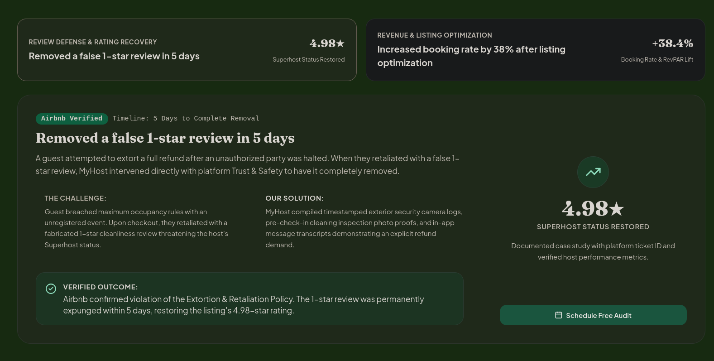
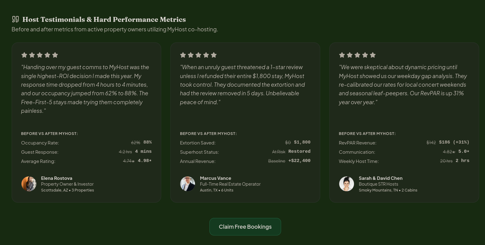

# MyHost Production Launch Handover Guide

This folder contains all materials needed to configure production copy, business contact details, pricing, and social proof before launching the live website.

---

## Quick-Start Workflow (3 Steps)

1. **Update Content**: Open [`content.json`](./content.json).
   - All production copy, numbers, pricing, and FAQs are configured here.
   - It is **pre-populated with tested defaults**. You only need to edit the values you want to customize.
   - Any value you leave untouched will safely use the active default.
2. **Add Host Photos**:
   - Place 3 square host headshots in [`assets/testimonials/`](./assets/testimonials/):
     - `host-1.jpg` (Testimonial 1)
     - `host-2.jpg` (Testimonial 2)
     - `host-3.jpg` (Testimonial 3)
   - *Specs: Minimum 200×200px (400×400px recommended), JPG or PNG.*
3. **Review Visual References**:
   - If you need to see where any section appears on the live website, view the corresponding screenshot in [`screenshots/`](./screenshots/).

---

## Visual Field Guide & Reference Map

All edits are made directly in [`content.json`](./content.json). Use this guide to see where each field appears on the live website.

---

### 1. Top-Level Numbers & Key Metrics (`hero.metrics`)
*Where it appears: The 4 stat cards directly below the main headline in the Hero section.*

* **Key in `content.json`**: `"hero": { "metrics": [ ... ] }`
* **Card Count**: Exactly 4 metric cards.
* **Tips**: Keep values short (≤ 8 characters, e.g. `< 5m`, `4.9 / 5.0`, `100%`) and labels clear (≤ 25 characters) to ensure cards fit cleanly on mobile screens.

---

### 2. Multi-Platform Coverage & Operations Software (`platformBar`)
*Where it appears: The horizontal brand bar directly below the Hero section.*

* **Key in `content.json`**: `"platformBar": { "bookingChannels": [ ... ], "operationsTools": [ ... ] }`
* **Booking Channels (3 items)**: The major OTAs where your properties are listed (e.g. Airbnb, VRBO, Booking.com) along with your partner tier badge.
* **Operations Software (3 items)**: The PMS, dynamic pricing, and cleaner dispatch software you leverage (e.g. Guesty, PriceLabs, Turno).

---

### 3. Pricing Packages & Plans (`pricing.plans`)
*Where it appears: The 3 tier cards in the Pricing section.*

* **Key in `content.json`**: `"pricing": { "plans": [ ... ] }`
* **Plan Count**: Exactly 3 tiers (Basic, Full-Service, Custom Portfolio).
* **Editable Fields**:
  - `name`: Tier name (e.g., *Basic*, *Full-Service*, *Custom Portfolio*)
  - `tagline`: One-sentence summary under the plan name
  - `priceMonthly` & `priceAnnual`: Monthly and discounted annual dollar amount
  - `percentageRate`: Optional revenue-share percentage note (e.g., *Or 15% of booking revenue*)
  - `description`: Target host audience description
  - `features`: Array of included bullet points
  - `ctaText`: Button label (e.g., *Start with Basic*, *Choose Full-Service*)
  - `popular`: Set to `true` on your primary tier to display the highlighted badge

---

### 4. About & Trust Credentials (`aboutTrust`)
*Where it appears: The About & Trust section directly below the headline and credentials grid.*

* **Key in `content.json`**: `"aboutTrust": { "companyHistory": "...", "credentials": [ ... ] }`
* **Company History**: 2–3 sentences explaining why your company exists and how it differs from traditional property managers.
* **Credentials (4 cards)**: 4 key institutional differentiators (e.g., Hospitality Experience, Policy Dispute Savvy, Certified Tooling, Owner Financial Protection).

---

### 5. Case Studies (`socialProof.caseStudies`)
*Where it appears: The interactive Case Studies tab in the Social Proof section.*

* **Key in `content.json`**: `"socialProof": { "caseStudies": [ ... ] }`
* **Count**: Exactly 2 turnaround stories (Case 1: Review Defense, Case 2: Listing Optimization).
* **Structure**: Each case study contains:
  - `title`: Main headline result
  - `tag`: Category label (e.g., *Review Defense & Rating Recovery*)
  - `duration`: Time to resolution (e.g., *5 Days to Complete Removal*)
  - `metricHighlight` & `metricLabel`: Key stat callout (e.g., `4.98★` / `Superhost Status Restored`)
  - `summary`: High-level 2-sentence overview
  - `challenge`, `solution`, `result`: The 3-part breakdown of the issue, action taken, and verified outcome.

---

### 6. Host Testimonials (`socialProof.testimonials`)
*Where it appears: The Testimonials grid in the Social Proof section.*

* **Key in `content.json`**: `"socialProof": { "testimonials": [ ... ] }`
* **Count**: Exactly 3 host reviews.
* **Structure**:
  - `author`: Host full name (e.g., *Elena Rostova*)
  - `role`: Host title / background (e.g., *Property Owner & Investor*)
  - `location`: Market & property count (e.g., *Scottsdale, AZ • 3 Properties*)
  - `avatar`: Path to headshot photo (e.g., `/assets/testimonials/host-1.jpg`)
  - `rating`: Star rating (1 to 5)
  - `quote`: Host testimonial statement
  - `stats`: 3 before/after proof metrics (e.g., Occupancy Rate Before: `62%` → After: `88%`)

---

### 7. Frequently Asked Questions (`faq.items`)
*Where it appears: The FAQ accordion on the live website.*

* **Key in `content.json`**: `"faq": { "items": [ ... ] }`
* **Count**: Exactly 7 core host questions covering Multi-Platform Support, Review Appeals, Listing Ownership, Consultation Next Steps, Free-First-5 Guarantee, Contracts, and Cleaner Dispatch.
* **Editing**: Update the `answer` string for any FAQ to match your company's exact operational policies.

---

### 8. Direct Contact & Operational Channels (`bookingContact.channels` & `footer`)
*Where it appears: Direct contact sidebar, consultation modal, and website footer.*

* **Key in `content.json`**: `"bookingContact": { "channels": { ... } }` and `"footer": { ... }`
* **Fields**:
  - `phoneNumber`: Formatted business phone number (e.g., `+1 (800) 555-4678`)
  - `whatsApp.phone`: E.164 phone number with country code for direct chat linking
  - `whatsApp.text`: Pre-filled customer greeting message
  - `calendarWidgetProvider`: Name of consultation tool (e.g., `Google Meet` or `Zoom`)
  - `operationalEmail`: Inquiries email address (e.g., `contact@myhost.com`)
